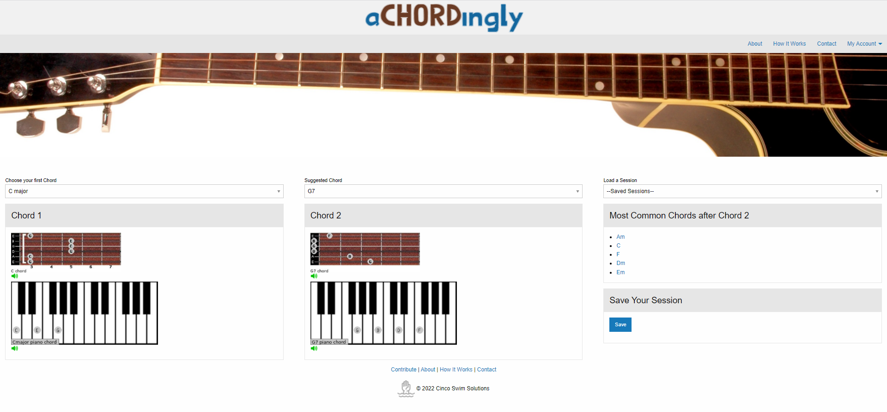

# Team
 Cinco Swim Solutions

## Members & Roles

Aziz: Sketch

William: Javascript

Echeta: Wireframe, HTML, CSS

Michael: Javascript, API.

Don: UX

## Description
As a beginner guitarist, what are the most common chord changes to know? This app will allow the user to learn the most popular chord patterns in music. Useful for beginners who only know two or three chords. 

a**CHORD**ingly focuses on an important subset skill: putting two or three chords together. You select a chord and practice that. 

Our app then suggests a probable second chord. You can then practice putting the two chords together to build fluency.
And perhaps choose a third chord to add or try a new session.
Before long, you will begin to develop the dexterity and aural skills to tackle those songs!

## Screenshot of App

## Technologies Used
- HTML
- Foundation CSS
- Javascript
- JQuery
- Hooktheory AP
- Chords-Scales API
- TonalJS
- EmailJS
- Asynchronous Development: Trello & Github Issues integration, Slack.

## Link for the repo
https://github.com/michaelpalumbo/achordingly

## Deployment Link
https://michaelpalumbo.github.io/achordingly

## Trello board
https://trello.com/b/7NjWUsJy/cinco-swim-project

