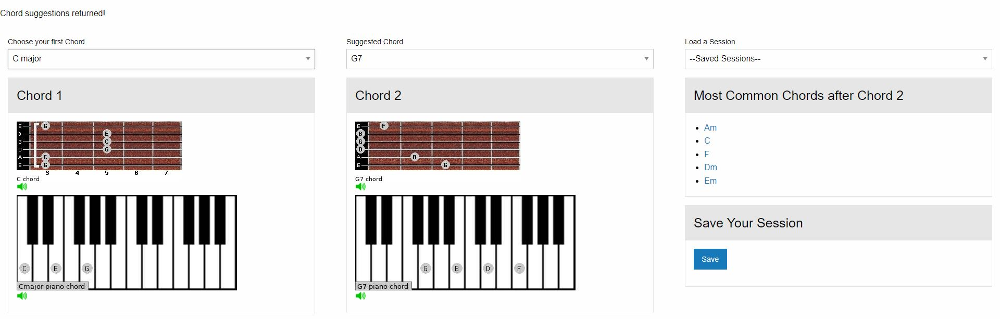

# Team
Cinco Swim

## Members & Roles

Aziz: Sketch

William: Javascript

Echeta: Wireframe, HTML, CSS

Michael: API, Javascript. 

Don: UX

## Description
As a beginner guitarist, what are the most common chord changes to know? This app will allow the user to learn the most popular chord patterns in music. Useful for beginners who only know two or three chords. 

##

## Link for the repo
https://github.com/michaelpalumbo/achordingly

## Deployment Link
https://michaelpalumbo.github.io/achordingly

## Trello board
https://trello.com/b/7NjWUsJy/cinco-swim-project

